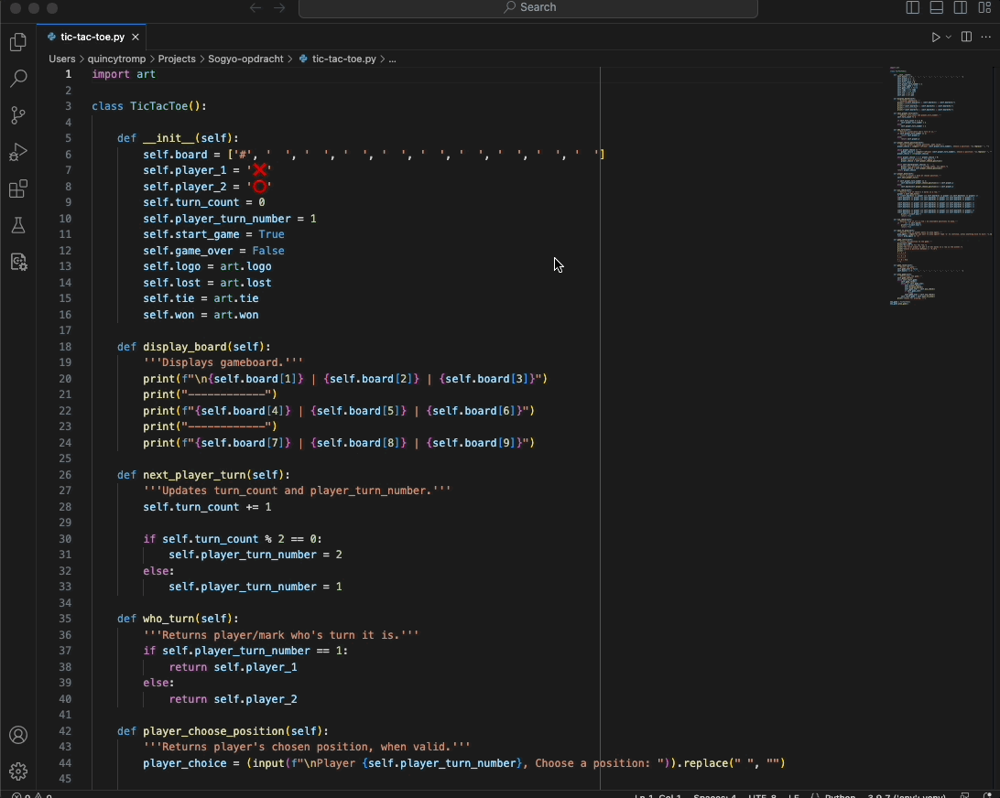

# Sogyo TicTacToe assisgment

This is an assignment I did during my application process at Sogyo, where I had to build a Tic Tac Toe game in Python.

## Assisgnment
Write an implementation in Python for the tic tac toe game.

You can assume that there are two players behind a console.
The players play against each other.
Your program must indicate to the players after each move whether:
* the game is won by a player;
* there is a tie;
* one more possible move can be made.

Think about this:
* What do you think is the best data structure for the game?
* What do you think is the best naming for your functions/methods?
* What do you think is the best flow in your code?
* How best to test the game?

Bonus:
* Make the implementation according to object oriented design:
   * think about encapsulation;
   * think about where best to invest the "state" of the game;
